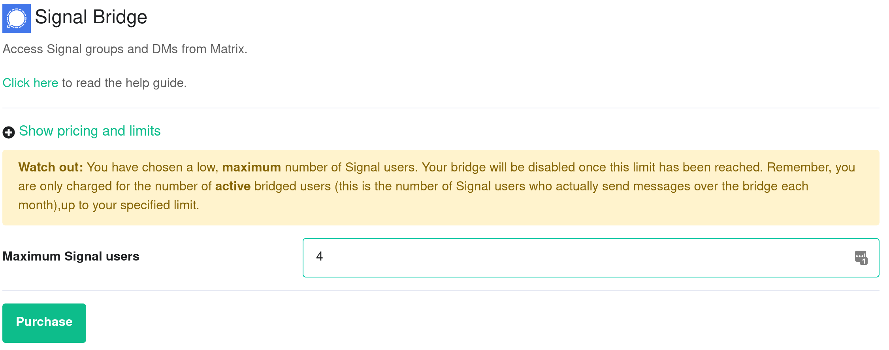
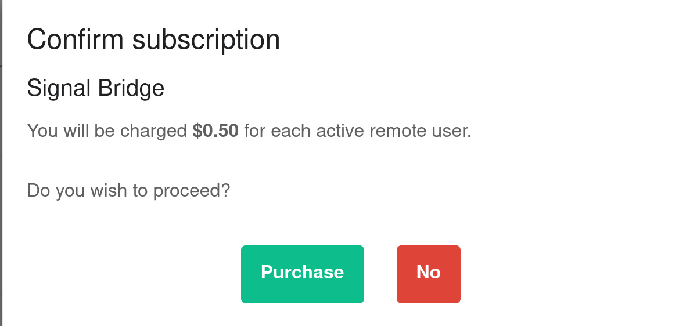
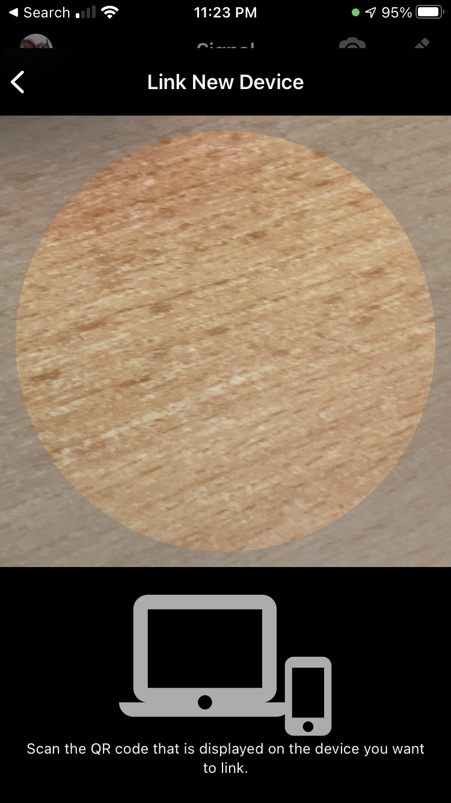
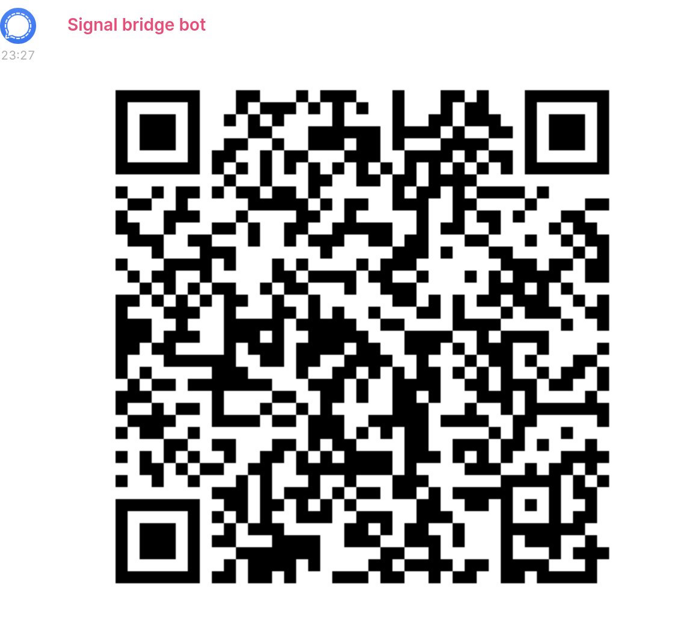

# Add a Signal Bridge

This guide explains how to use the Signal bridge from the EMS Integration Manager to integrate your Signal chats with your EMS server.

It requires your EMS server to have federation on.

The following instructions are done with the  Element Desktop on the Element side and on Element iOS for the Signal side. Element Android should be almost identical to Element Web.

## Purchase  the Signal integration

1. Open the EMS control panel at: [https://ems.element.io/user/hosting](https://ems.element.io/user/hosting)  
Click the `Integrations` tab  and if you have more than one server, select the server you wish to add the Signal integration to  
  

1. Click on `Signal Bridge` in the list of available Bridges
  

1. Enter the maximum number of users in `Maximum Signal users`.  
Please note:  **this is the maximum number of Signal users who actually send messages over the bridge each month. You are only billed for the number of Signal users who are active. Once you exceed the maximum, then the bridge will be disabled until you increase the maximum.**  
If you enter less than `5`, you will get a warning  
  
If you enter `5` or greater in `Maximum Signal users`, you will not see a warning  
  
Once you have entered `Maximum Signal users`, click `Purchase` (remember you can always go back to this step and increase the maximum number of Signal users if you need more in the future).

1. A dialogue will remind you of the price per user and ask if you wish to proceed. Click `Purchase` if you wish to proceed with the Signal Integration  
  

1. You will have to wait a few minutes while your host is reprovisioned with the Signal bridge.
Once reprovisioning is finished, you are able to bridge Signal to your EMS server using your Element client.

## Bridge Signal to your EMS server

1. Once the bridge is running, open your Element app. Click on the `+` next to `People`

1. Create a Direct Message conversation by typing `@signalbot:example.ems.host` (replace the domain with the one of your homeserver). Then click`Go`

1. The bridge account will join your room and tell you how to use it

1. Open Signal on your mobile device (iOS or Android) and tap on your avatar to go to `Settings` and then `Linked Devices` and then `Link New Device` to start the Signal QR code scanner. You will use this QR code scanner to scan a QR code displayed by your Element client in the next step  

1. From your Element client, send a `link` message to the bot to connect to your Signal account  

1. A QR code will be displayed. Quickly scan the QR code with Signal on your mobile device. You have about a minute before it times out. If it times out, just send the login message again to generate another QR code  

1. On your Element client, you will see `Successfully logged in as <your_phone_number>` e.g. `Successfully logged in as +1 555-555-5555` and you will see invitations for each of your Signal chats in your Element client. Each Signal chat is a separate Matrix room. Join one or more chats and start chatting from either your Element app on desktop, iOS or Android or your Signal on mobile.
